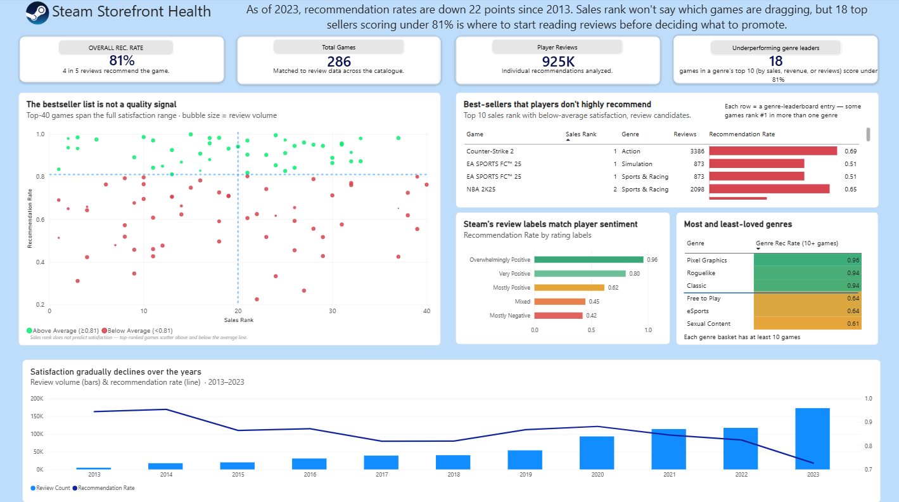
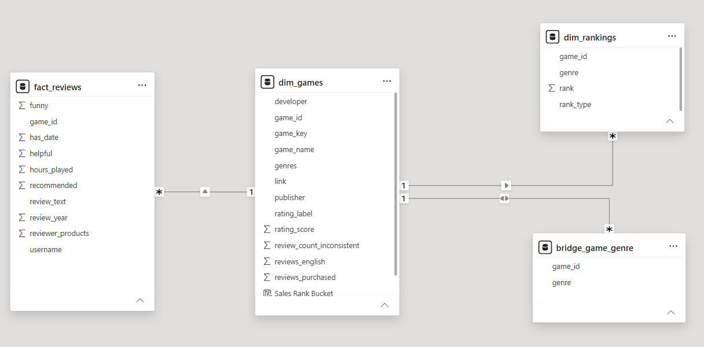

# Steam Storefront Health
 
A Databricks medallion pipeline (bronze → silver → gold star schema) over 991K Steam reviews, feeding a Power BI dashboard on storefront health.

**The brief:** As a Steam executive, understanding the health of the storefront and its reputation with players is important. Using historical data, 991K player reviews across 286 games, plus genre sales leaderboards and Steam's own review labels, surface which games the storefront should promote, which top sellers are quietly hurting player trust, and how satisfaction has moved over time.
 
**The finding:** Using sales as a metric for game success is the wrong guide. Top sellers land above and below the satisfaction average in roughly equal numbers, and 18 games ranked in a genre's top 10 scored below the 81% catalogue average — spread across Action, Simulation, and Sports & Racing. Review labels are the better guide, matching review sentiment closely. Meanwhile overall recommendation rates have fallen 22 points since 2013. The suggestion: promote on sentiment, not rank.

 

 
## Data
 
[Steam Games, Reviews, and Rankings](https://www.kaggle.com/datasets/mohamedtarek01234/steam-games-reviews-and-rankings) (Kaggle):
 
| File | Grain | Rows |
|---|---|---|
| games | one row per game | 286 |
| reviews | one row per review | ~991K |
| rankings | game × genre × rank type | genre leaderboards |
 
 
## Architecture
 
```
                    Kaggle CSVs
                         │
                         ▼
              ┌────────────────────┐
              │       BRONZE       │   raw ingestion, no transformation
              │  games · reviews   │
              │      rankings      │
              └─────────┬──────────┘
                        │   type casting · date parsing
                        │   list parsing · game_key normalization
                        ▼
              ┌────────────────────┐
              │       SILVER       │   cleaned, typed, joinable
              │  silver_games      │
              │  silver_reviews    │
              │  silver_rankings   │
              └─────────┬──────────┘
                        │   surrogate keys · dimensional modeling
                        ▼
              ┌────────────────────┐
              │        GOLD        │   star schema
              │                    │
              │  dim_games ──┬── fact_reviews
              │              ├── dim_rankings        (snowflake arm)
              │              └── bridge_game_genre   (game ↔ genre)
              └─────────┬──────────┘
                        │
                        ▼
                     Power BI
```
 

 
- `bridge_game_genre` uses bidirectional cross-filtering. Without it, picking a genre filters the bridge but never reaches `fact_reviews`, so every genre shows the same catalogue-wide 81%.

## Data quality
 
- **Type casting.** Numerics arrive as strings with thousands separators (`1,234`), so they're stripped and cast rather than silently coerced.
- **Date parsing.** Steam's `date` field comes in two shapes — `November 27, 2019` and `March 21`. About 23% carry no year; those are set to `NULL` and excluded from trend analysis.
- **The leaked year.** A 4-digit number is glued to the front of many reviews, which looks like a way to recover the missing years. However, very few values were actually recoverable this way, and the ones extracted had severe quality issues (e.g. a review saying `1453 was an inside job` would extract 1453 as a "year", which isn't possible).
- **Name standardization.** Game names are spelled inconsistently across the three files (`EA SPORTS FC™ 25` vs `EA SPORTS FC 25`). All normalize to a lowercase, symbol-stripped `game_key` before joining.
- **List parsing.** Genre and category columns are Python reprs. Quote-swapping breaks on values like `Beat 'em up`, so they're parsed with a UDF wrapping `ast.literal_eval`.

## Limitations

- **Rank is per-genre, not global.** `dim_rankings` holds genre leaderboard positions, so a game can be #1 in Simulation and #30 in Sports & Racing. Counter-Strike 2 shows up as rank 1 in Action, but that's only on Action's list, not Steam's overall bestseller list, which is data unavailable to us. "Top 10" throughout means top 10 in at least one genre.
- **Per-game rates are lifetime averages.** All of a game's reviews get pooled into one number — a game rated 0.4 in 2013 and 0.8 in 2014 shows as roughly 0.6. This hides direction, so tracking how a game develops over time would need a separate visual splitting rates by game and year.
- **The source files cover different catalogues.** Inner joining games to reviews drops the catalogue from 286 to 227 — 59 games have no review data, and ~59K reviews reference games missing from the games file. All satisfaction metrics run over the 227-game intersection.
- **Reviews are bucketed by when they were written, not when the game came out.** A 2023 review of a 2015 game counts toward 2023. So the declining trend means players writing in recent years were less positive — not that newer games are worse.
- **2010–2012 hold under 700 reviews each**, so the trend chart starts at 2013.

## Running this
 
1. Clone into a Databricks workspace (Repos → Add Repo).
2. Run in order: `bronze/` → `silver/` → `gold/`. Each notebook is idempotent — tables are created with `CREATE OR REPLACE`.

## Stack
 
Databricks · PySpark · Spark SQL · Delta Lake · Power BI · DAX
 
